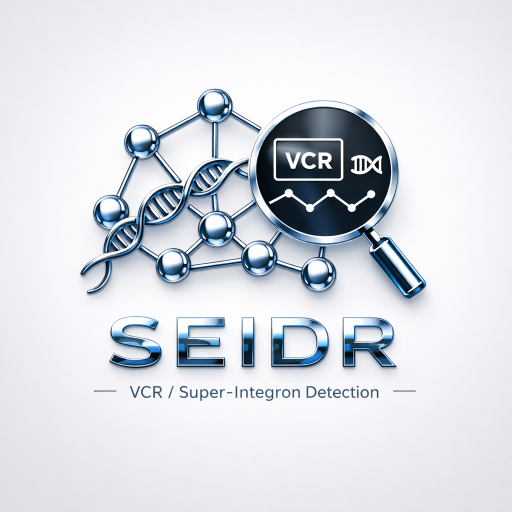

<p align="center">
  
</p>

# seidr — VCR / super-integron detection on a de Bruijn graph

*Old Norse **seiðr**: the craft of seeing what is hidden.*

Detects *Vibrio cholerae* **VCR (attC) recombination sites** — the repeats of the
chromosomal super-integron — **directly from raw reads on MEGAHIT's succinct de
Bruijn graph, without assembly.**

Why assembly-free: attC sites are near-identical repeats, and assemblers collapse
or fragment repeat arrays. Working on the read graph sidesteps that.

## Algorithm

```
detect_VCRs(reads):
    G = succinct_de_Bruijn_graph(reads, k = 23)          # MEGAHIT, keep all k-mers (-m 1)

    # The attC covariance model, read as a chain of consensus columns. Each column is
    # a SINGLE base or one half of a base-PAIR (the attC hairpin), carrying log-odds:
    #   SINGLE  : 4 scores  (A C G T)
    #   PAIR_5' : 4 scores  (its base, marginal)
    #   PAIR_3' : 16 scores (5'-base  x  this 3'-base) — scores the pair, both bases known
    M = parse_covariance_model("Vibrionales.cm")

    candidates = {}
    for v in nodes(G):

        # 1) ANCHOR — a VCR start.
        #    Every cassette ends in a STOP just before the VCR, and all VCR copies
        #    collapse onto one path, so the VCR-start node has >= 2 predecessors.
        if indegree(v) < 2:                              continue
        if bases(3 nodes upstream of v) not a STOP:      continue        # TAA / TAG / TGA

        # 2) FOLD-WALK — thread graph paths through the model, scoring base PAIRS.
        #    A path carries a STACK: push the 5' base of a pair, pop it to score the
        #    pair when its 3' partner is reached. The beam keeps the W best paths.
        beam = [ seed_path_at(v) ]            # anchor k-mer aligned to the first columns
        best = none
        while beam not empty:
            grown = []
            for p in beam:
                if p.col > length(M):                        # whole model consumed
                    best = max_by_score(best, p);  continue  #   -> a complete VCR
                for b in {A, C, G, T}:
                    if shift(p.kmer, b) not in G:  continue  # follow only real edges
                    c = M[p.col]
                    if   c is SINGLE:    d = c.score[b]
                    elif c is PAIR_5':   d = c.score[b];               push(p.stack, b)
                    elif c is PAIR_3':   x = pop(p.stack);  d = c.pair_score[x][b]
                    grown += p.extend(b, col = p.col + 1, score = p.score + d)
            beam = top_W(grown, by = score)
        if best != none:  candidates += best.seq             # one VCR per anchor

    # 3) VALIDATE the secondary structure with the full covariance model.
    return { c in candidates : cmsearch("Vibrionales.cm", c).E_value <= threshold }
```

## Requirements (Linux / WSL)
`git`, `cmake` (≥3.12), `g++` (C++17), `make`, `zlib`, `curl`, `python3`.
Optional, for benchmarking against a reference: NCBI BLAST+ (`blastn`, `makeblastdb`).

## Setup
```bash
bash build_megahit.sh    # clone + build MEGAHIT (SDBG builder)  -> megahit/build/megahit_core
bash build_infernal.sh   # build Infernal (cmsearch)             -> deps/
bash compile.sh          # compile the detector vs MEGAHIT's SDBG -> build/vcr_fold
```

## Run
```bash
MH=megahit/build/megahit_core
# 1. build the SDBG from your reads (single- or paired-end)
printf '#sample\nse reads.fq.gz\n' > reads.lib            # paired:  pe r1.fq.gz r2.fq.gz
"$MH" buildlib reads.lib lib
"$MH" read2sdbg --host_mem 4000000000 -m 1 -k 23 --read_lib_file lib --o graph

# 2. covariance model -> per-column pair model
python3 cm_to_pairmodel.py models/Vibrionales.cm pairmodel.txt

# 3. detect, then validate the structure
./build/vcr_fold graph pairmodel.txt candidates.fa
deps/bin/cmsearch -E 0.01 models/Vibrionales.cm candidates.fa     # keep the attC hits
```

## Files
| file | what |
|---|---|
| `models/Vibrionales.cm` | the attC covariance model (Infernal) |
| `cm_to_pairmodel.py` | covariance model → per-column pair model |
| `vcr_fold.cpp` | the detector: anchors → CM-guided fold-walk → VCR candidates |
| `build_megahit.sh`, `build_infernal.sh`, `compile.sh` | build MEGAHIT, Infernal, the detector |

## Results
- **Real reads** (*V. cholerae* N16961, ERR12040587, ~60×, assembly-free): recovers
  the **sequence of ~93% of attC sites exactly (≥99% identity) and ~99% near-exact**,
  at **~100% precision** (validated by `cmsearch` + BLAST to the reference genome).
